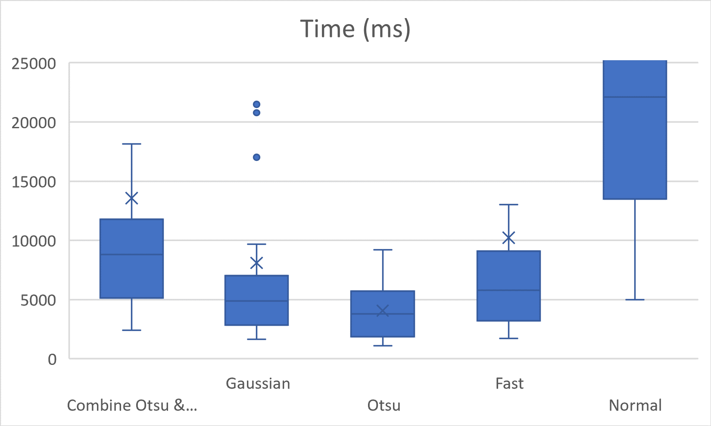
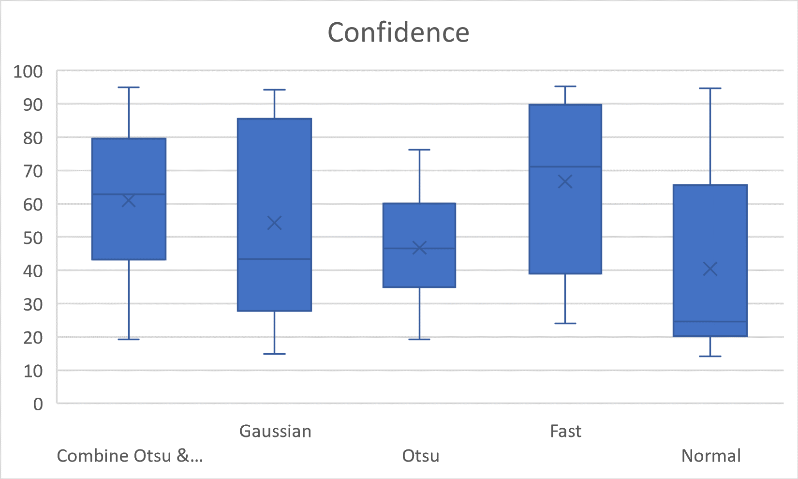
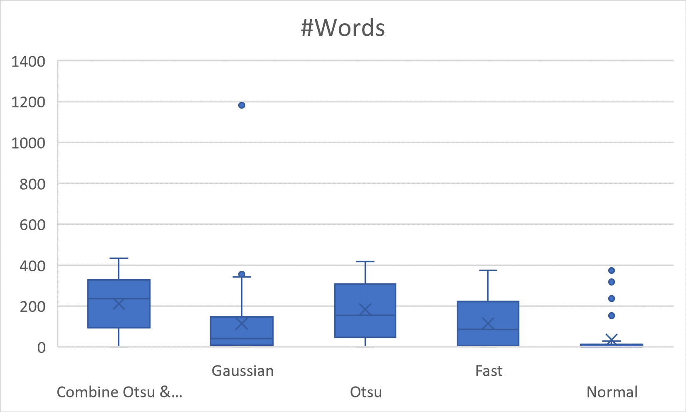

# Tesseract UI Tools

## Table of contents

*. [About](#about)
*. [User Interface Overview](#user-interface-overview)
*. [Installation](#installation)
*. [Mail Notification](#mail-notification)
*. [Usage](#usage)

## About

Tesseract UI Tools is an application that allows you to bulk apply the [Tesseract OCR](https://tesseract-ocr.github.io/) engine on multiple files to create PDFs with text layer.
This application is designed to make it easy to process a large number of files in a batch, allowing to queue multiple jobs to be processed in the background.

A job consists on multiple parameters: input folder, output folder, languages to recognize, preprocess strategy, DPI, quality and minimum confidence.

Currently the application can handle the following formats: TIFF, TIF, JPEG, JPG and PDF.

## User Interface Overview

## Installation

1. Download the latest [release](https://github.com/Tesseract-UI-Tools/Tesseract-UI-Tools/releases/).
2. Unzip the file.
3. Run the `Tesseract UI Tools.exe` file.
    - **Note:** During the first execution:
        1. .NET Desktop Runtime 6 might be automatically installed via a prompt popup.
        2. The language models will be downloaded, which might take some time.

## Usage

The main screen shows a table with the queue of jobs of this session. It also allows to set an email address to receive notifications by mail. See [Mail Notifications](#mail-notification) to setup it.

Each line of the table represents a job. It has a start time, the input folder and the status (which is either "Created", "Running" or "Finished").

### Adding a job

After click on "Add Job" a new form will popup. In this form you can set the parameters of the job:

 - Input Folder
 - Output Folder
 - Language(s)
 - Preprocessing strategy: See [Preprocessing Strategies](#preprocessing-strategies)
 - DPI: Dots per inch, affects the width and height of the resulting images in the PDF. Value between 70 and 300.
 - Quality: Quality compression of the resulting images in the PDF. Value between 0 and 100.
 - Min Conf: Minium tesseract confidence required. Value between 0 and 100.

After clicking on "Add Job" on this form it will close and the job is added to the queue. You can now add a different job. The last parameters used are saved during a session only.

#### Preprocessing strategies

The following table represents the steps of each strategy preprocessing each image:

| Fast | Otsu | Gaussian | Fast & Otsu |
|------|------|----------|-------------|
| Reduce Image Size | Reduce Image Size | Reduce Image Size | Reduce Image Size |
| Tesseract | Median Blur | Median Blur | Median Blur & Tesseract (1) |
| | Otsu Threshold (Global) | Gaussian Threshold (Local) | Otsu Threshold (Global) |
| | Dilate | Dilate | Dilate |
| | Tesseract | Erode | Tesseract (2) |
| | | Tesseract | Merge Best Tesseract |

We tested each strategy against the same input and found that:
**Regarding time** Otsu was the fastest strategy, with a 4-second average. Followed by Gaussian with an 8-second average and Fast with a 10-second average.
This result is mainly caused because we are reducing to half the image before any other step.
Without reducing the image, the Plain strategy takes an average of 55 seconds. However, the number of words and confidence are not improved.

## Mail Notification

Tesseract UI Tools can send an email notifying that a job has completed.

The email consists in a report with two tables. The first table contains the start time and the parameters for that job. The second table contains information of the tesseract confidence and time for each file processed.

This file is also saved under the reports folder with the name `report-{DateTime.Now}.html`.

### Sample Mail

| Parameter    | Value                 |
|--------------|-----------------------|
| Start Time   | 01/01/1970 00:00:00   |
| InputFolder  | C:\\...\\Test\\Input  |
| OutputFolder | C:\\...\\Test\\Output |
| Language     | eng                   |
| ...          | ...                   |

| Start Time | Filename | Pages | Time Ellapsed | Words Threshold / Words Total | Confidence Mean Threshold / Confidence Mean Total |
|------------|----------|-------|---------------|-------------------------------|---------------------------------------------------|
| 01/01/1970 00:00:00 | File 1 | 5 | 36s | 957 / 1115 | 77.96429 / 68.227715 |
| 01/01/1970 00:00:36 | File 2 | ... | |  |  |
| ... | File 3 | | |  |  |

### Notes

The column "Words Threshold / Words Total" contains the number of words that have a confidence bigger than the minimum confidence asked and the number of words in total.
Similarly, "Confidence Mean Threshold / Confidence Mean Total" contains the mean confidence for words bigger than the minimum confidence and the mean of all word confidences.

### Configure Mail Server Settings

To receive this report by email the user needs to have access to a server relay or a Google Account.

Using a server:

1. On the main screen click "Mail Settings"
2. Fill the Host, Port and From inputs.

Using a Google Account:

1. On the main screen click "Mail Settings"
2. Click on "Google"
3. Login with a google account that will be sending the email
4. Allow `Tesseract UI Tools` to send mail with your account.
