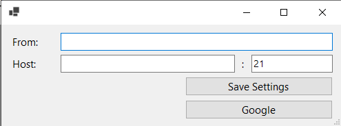

# Tesseract UI Tools

## About

Tesseract UI Tools is an application that allows you to bulk apply the [Tesseract OCR](https://tesseract-ocr.github.io/) engine on multiple files to create PDFs with text layer.

You can specify the input and output folders, one or more languages of the tet to recognize, the pre-processing strategy, custom DPI and quality of the resulting PDF and the minimum confidence Tesseract should have.

Currently the application can handle the following formats: TIFF, TIF, JPEG, JPG and PDF.

## User Interface Overview

## Installation

 1. Download the latest release compressed file from the [releases page](https://github.com/Tesseract-UI-Tools/Tesseract-UI-Tools/releases/).
 2. Unzip the file.
 3. Run the `Tesseract UI Tools.exe` file.
  - During the first execution:
   1. .NET Desktop Runtime 6 might be automatically installed via a prompt popup.
   2. The language models will be downloaded, which might take some time.
