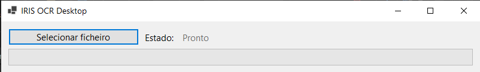

1. [Sobre](#about)
2. [User Interface Overview](#user-interface-overview)
3. [Installation](#installation)
4. [Usage](#usage)
5. [Mail Notification](#mail-notification)

## Sobre

IRIS OCR Desktop é uma aplicação que permite usar o software [Tesseract OCR](https://tesseract-ocr.github.io/) num ficheiro para criar um PDF com camada de texto.
Esta aplicação foi desenhada para correr um simples ficheiro de cada vez, o ficheiro pode ser qualquer um dos seguintes formatos: TIFF, TIF, JPEG, JPG and PDF.

## Interface

## Installation

1. Descarregar a [última versão da aplicação](https://github.com/stjiris/simple-ocr/releases/).
2. Descomprimir os ficheiros.
3. Correr o ficheiro `IRIS OCR Desktop.exe`.
    - **Notas:** Durante a primeira execução do programa:
        1. A .NET Desktop Runtime 6 poderá ter de ser instalada automaticamente pelo windows.

## Utilização

O ecran principal mostra um botão para selecionar o ficheiro que se pertende correr. Após o ficheiro ter corrido é perguntado ao utilizador onde deseja guardar o ficheiro PDF final e um ficheiro TXT com o conteúdo.
